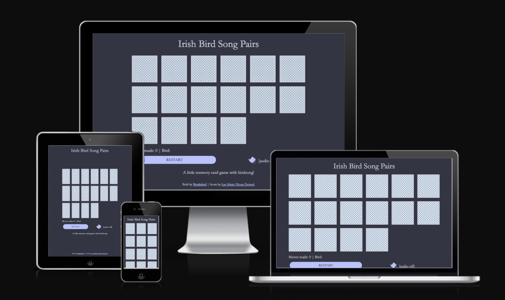
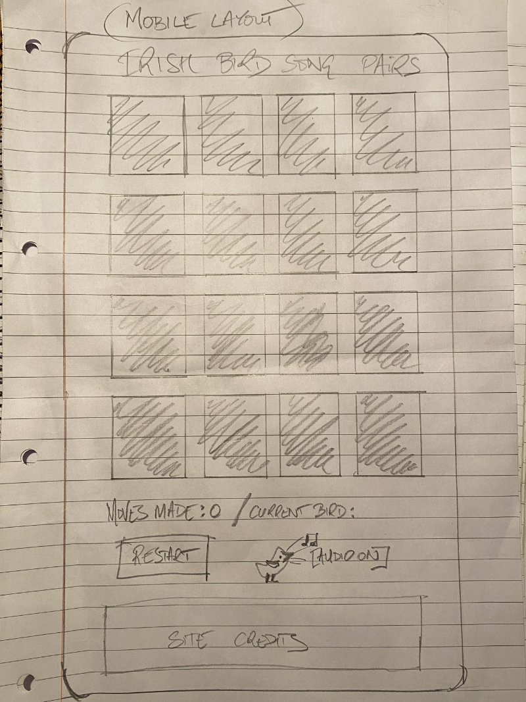
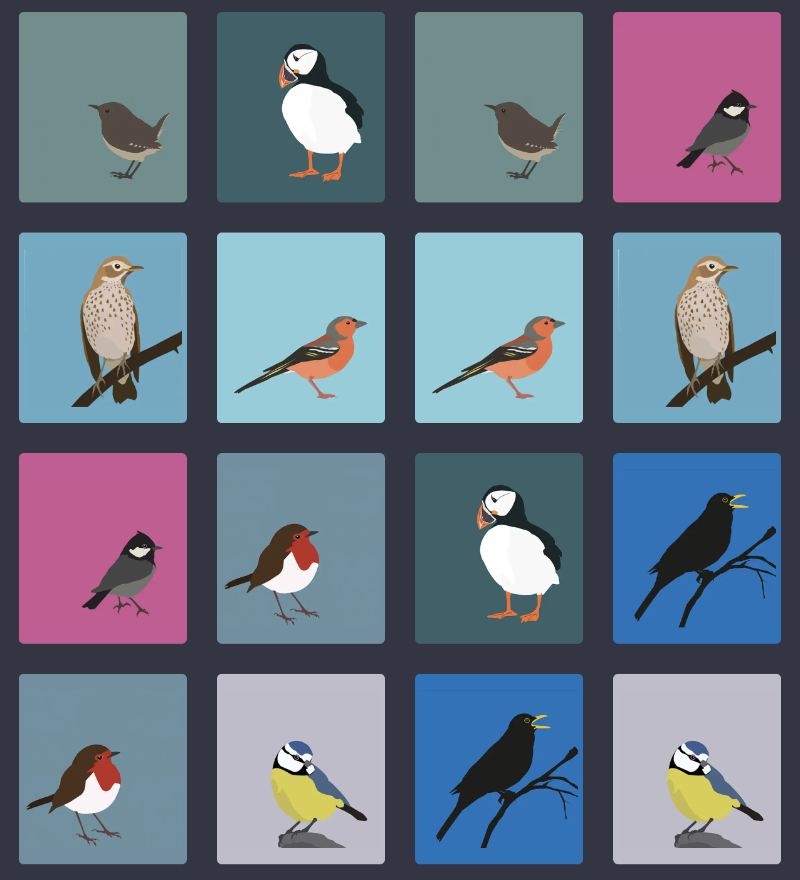
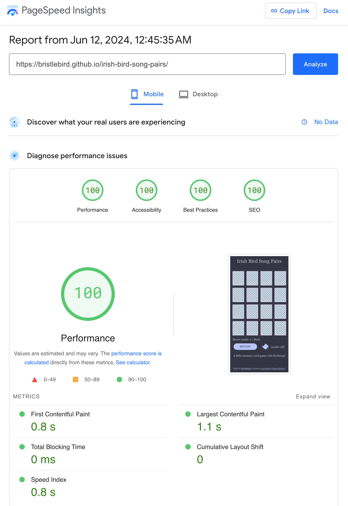

# Irish Bird Song Pairs

A simple javascript memory card game of Irish Birds and their songs! Inspired by [Match a Pair of Birds](https://www.laurenceking.com/products/match-a-pair-of-birds), a game I used to play with my kids when they were younger. This version of the game extends  the original to include recordings of bird song for each species which is played when a card is turned, so the player can match the birds by the visual illustrations alone, by both the visual and the bird song together, or they can play blind and match pairs just by the by bird song.

The object of the game is to match all 8 pairs of birds in as few moves as possible by remembering where they are if you don't get match... nice and simple but it makes you think!

### Wireframe  

Simple mobile layout
  

 

## Features 

### Game area

- __Card deck__

  - A simple grid of 16 cards shuffled, turned over and ready to play. Start tapping the cards to turn them over and match all 8 pairs.

- __Feedback Display__ 

  - Displays the number of moves made (the lower the better!) and the name of the most recently revealed bird. The bird name stays hidden when you are playing with audio only to make it more challenging. 

- __Controls area__ 

  - Restart button turns all the cards face down and shuffles them  ready to start next game.
  - The bird audio control icon button cycles through the 3 modes of play:
 
	1. Audio off: just match the bird pictures with no sound
	2. Audio on: match the pairs of birds using pictures and bird song
	3. Audio only: just match the bird song with no pictures

### Future Features / Nice to haves
- At end of game, congratulate player & update highest score tally for current run of games.
- Timer to add quickest times to the score tally.
- Volume slider for the audio.
- Add ability to play song of flipped card when tapped.
- Add option to guess the name of the bird from the song in audio only mode.
- Multi-player: add option to have 2 (named) players who take it in turns; whoever gets the most pairs wins!
- Add different illustrations for male and female birds of same species, similar to [Match a Pair of Birds](https://www.laurenceking.com/products/match-a-pair-of-birds).
- Add a larger dataset, i.e. more bird species, so that it's not always the same 8 pairs each time you play. With a larger dataset, you could also have an option to add more cards to the game board on larger screens to make it more challenging and fun, particularly when playing another person.
- Further snippets of information about each bird and links to other song recordings could be added to extend the educational value of the game.
- Make it installable as a Progressive Web App / PWA in order to improve performance and to enable it to be played offline.

## Testing 

### Mobile
Mobile testing was carried out in Safari & Google Chrome browsers on an Apple iPhone 11 and found to work consistently on both. Further testing on Android devices is required. 
The site was also optmised and tested to work at smaller viewport widths using Google Chrome Developer Tools device toolbar (on desktop) — the smallest optimal viewport width tested was 375px x 667px (iPhone SE). Smaller viewport widths could be accommodated with fewer (i.e. 12) cards so that all could be viewed on the screen at once without scrolling.

### Desktop
The game was tested and found to work pretty consistently on desktop across the following desktop browsers on Mac OS X 10.15.7 (Catalina): Google Chrome, Mozilla Firefox, Microsoft Edge & Opera. However Apple Safari v.15.6.1 does not have Webp support on this version of Mac OS, so fallback jpeg (or png) images were required using responsive images with the picture element. See footnote 3 here: [https://caniuse.com/webp](https://caniuse.com/webp)
> Safari 14.0 – 15.6 has full support of WebP, but requires macOS 11 Big Sur or later.
Adding smaller thumbnail sizes in webp format also helped to improve web performance.

### Validator Testing 

- HTML
  - No errors returned on the official [W3C validator](https://validator.w3.org/nu/?doc=https%3A%2F%2Fbristlebird.github.io%2Firish-bird-song-pairs%2F)
- CSS
  - No errors returned on the official [(Jigsaw) validator](https://jigsaw.w3.org/css-validator/validator?uri=https%3A%2F%2Fbristlebird.github.io%2Firish-bird-song-pairs&profile=css3svg&usermedium=all&warning=1&vextwarning=&lang=en) 

### Web Perfomance

The site achieves high scores on all Google Lighthouse Page speed:
[https://pagespeed.web.dev/analysis/https-bristlebird-github-io-irish-bird-song-pairs/jcuc3t0h7x](https://pagespeed.web.dev/analysis/https-bristlebird-github-io-irish-bird-song-pairs/jcuc3t0h7x)

## Bugs & fixes
No major bugs were found. That said in the `newGame()` function, I found I had to use
 `
 for (let card of matchedCards) { card.classList.remove('match');  }
 ` 
 
 Instead of:
 
  `
 matchedCards.foreach(card => card.classList.remove('match'));
 `
 

## Deployment

The site has been deployed to Github pages from the master branch of this repository. 
[View the site here](https://bristlebird.github.io/irish-bird-song-pairs/).

## Credits

### Code
- Javascript Memory card game code inspiration from [JavaScript Academy](https://www.youtube.com/watch?v=xWdkt6KSirw), [FreeCodeCamp](https://www.youtube.com/watch?v=ZniVgo8U7ek&t) & [DevelopedbyEd](https://www.youtube.com/watch?v=-tlb4tv4mC4).
- Card background from Lea Verou's CSS Patterns Gallery CSS: [https://projects.verou.me/css3patterns/#shippo](https://projects.verou.me/css3patterns/#shippo)
- reset.css: [https://piccalil.li/blog/a-more-modern-css-reset/](https://piccalil.li/blog/a-more-modern-css-reset/) — A more modern css reset by Andy Bell.
- Fetch json data using javascript with Github pages: [https://stackoverflow.com/questions/72666698/github-pages-how-to-fetch-file-in-js-from-repo](https://stackoverflow.com/questions/72666698/github-pages-how-to-fetch-file-in-js-from-repo)

### Design 
- Bird Illustrations are copyright of [Bex Shelford](https://bexshelford.com), used with kind permission.
- Color namer by Chirag Mehta: [https://chir.ag/projects/name-that-color/](https://chir.ag/projects/name-that-color/) — used to name hex colors in css custom properties
- Colour contrast was checked using [ColorKit's Colour contrast checker](https://colorkit.co/contrast-checker/5e2753-e0edd2/)
- Bird icons by Lee Mette from [Noun Project](https://thenounproject.com/browse/collection-icon/tweeting-birds-5456/) (CC BY 3.0)
- Favicon created with: [https://favicon.io/favicon-converter/](https://favicon.io/favicon-converter/)

### Content
- Irish bird song recordings from [Xeno-Canto.org](https://xeno-Canto.org): [Blackbird](https://xeno-canto.org/728072) / [Blue Tit](https://xeno-canto.org/905221) / [Chaffinch](https://xeno-canto.org/735006) / [Coal Tit](https://xeno-canto.org/637591) / [Puffin](https://xeno-canto.org/253830) / [Robin](https://xeno-canto.org/670910) / [Song Thrush](https://xeno-canto.org/905252) / [Wren](https://xeno-canto.org/749506) 
